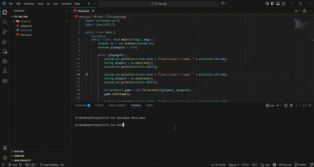

# Tic-Tac-Toe (CLI)

## How to Play

- Players: Two players take turns. One is X, the other is O.
- Board: A 3×3 grid shown in the command-line interface. Each turn, place your symbol in an empty square.
- Goal: Get three of your symbols in a row — horizontally, vertically, or diagonally.
- Turn order: X usually goes first. Players alternate until someone wins or the board is full.

## Winning and Draws

- Win: If you place three of your symbols in a straight line, you win immediately.
- Draw: If all squares are filled and neither player has three in a row, the game is a tie.

## Simple Strategy Tips

- Start in the center when you can — it gives the most chances to make three-in-a-row.
- Block your opponent: if they have two in a row, place your symbol to stop them.
- Think one move ahead: consider how a move creates opportunities for both players.

## Variations

- Play best-of-three or best-of-five matches to reduce luck and reward strategy.
- Try switching who goes first each game for fairness.

## About the Game

This version is a simple command-line (text-based) game of Tic-Tac-Toe. It keeps the classic rules and quick play of the paper-and-pencil original while running in a terminal window. It's easy to learn, fast to play, and great for practicing strategic thinking. Games are usually short and perfect for casual play or deciding small decisions.

Have fun and enjoy the game!

## Demo

- Preview:

